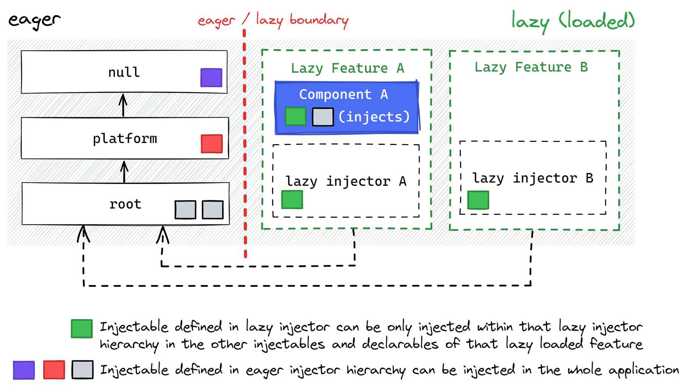

# Injector Hierarchy

In Angular, the **injector hierarchy** determines how instances of injectables, such as services, are
created and provided to consumers. It follows a tree structure that aligns with the application's
dependency graph.

Angular applications consist of **eager-loaded** and **lazy-loaded** parts.

Eager-loaded injectors include the **root injector**, where services registered are, accessible
across the entire application, including lazy-loaded modules.
A service declared with `@Injectable({ providedIn: 'root' })` ensures a single shared instance
across the application.

In contrast, lazy-loaded features create their own `EnvironmentInjector`, isolating their services
from other lazy modules and the root injector. Services defined in `providers: []`
within lazy-loaded modules or routes are scoped to that specific feature. If the same service
is provided in multiple lazy modules, each module gets its own instance.

Similarly, if a service is provided in both the root injector and a lazy module, separate instances
exist. This structure enables modular, isolated features while maintaining shared services where needed.

