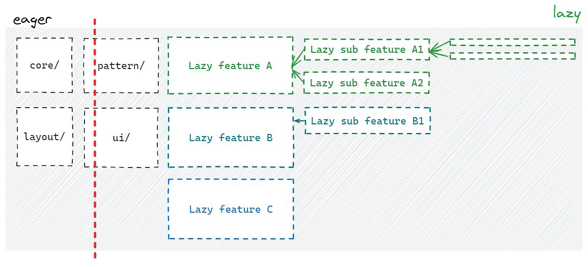

# Fractal nature

Lazy features can have multiple levels of sub-features, just like a tree with branches.

This "fractal nature" means we can keep adding more sub-features and navigation levels without
changing the basic structure. No matter how deep we go, the pattern stays the same!

