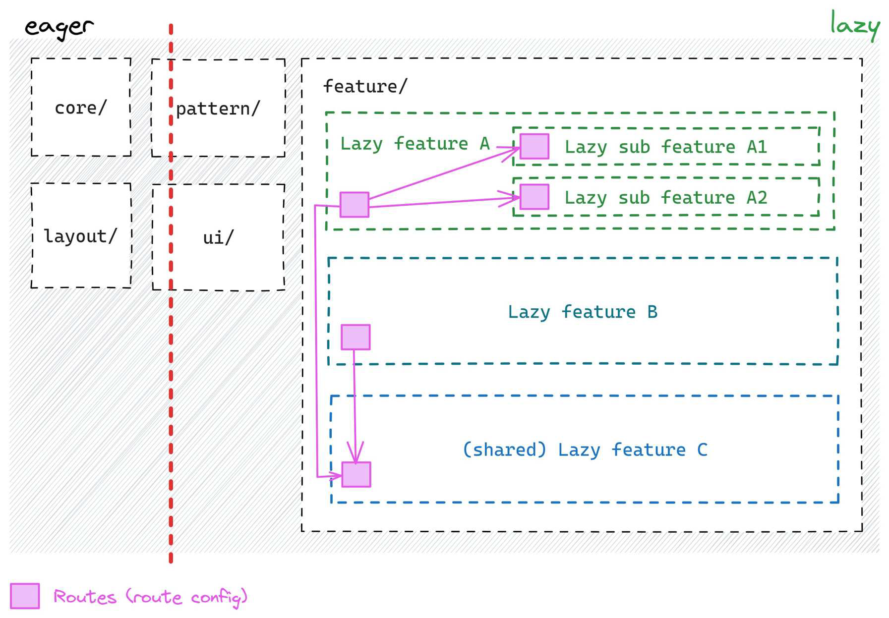

# Sharing features

Usually, we share logic (UI components, services, or patterns) by moving it **one level up**.
But what if we need to **share an entire sub-feature** (like a details view) between multiple lazy features?

Instead of duplicating it, we define it **once** and reference it in multiple places using `routes`.

!!! example "Both Orders and Tasks need a Details View"

    Instead of creating two separate details views, we put **one shared** details feature in `feature/details/`.
    Each lazy feature (`Orders` and `Tasks`) **links** to it using route configuration.

!!! important "The key rule"

    We can reference a shared sub-feature in **routes**, but not directly in the implementation.
    This keeps everything modular and isolated!

    ```ts
    export default <Routes>[
        {
            path: '',
            component: OrderListComponent,
        },
        {
            path: ':id',
            loadChildren: () => import('../details/detail.routes'),
            // notice the "../" we are leaving the feature/orders/folder
            // and entering sibling lazy feature feature/details/
            // which is forbidden for the actual implementation but not for the routes!
        }
    ]
    ```

## Shared feature vs lazy sub feature

Lazy sub-features and shared features **both load the same way**, but there's a key difference:

**Lazy sub-feature** -> Stored inside its parent's folder, follows the **"black box"** approach
(less strict isolation).

**Shared feature** -> Stored in a separate folder, has **full isolation** and can **only** be
referenced via routing.

In short, lazy sub-features belong to their parent, while shared features stay completely independent.


