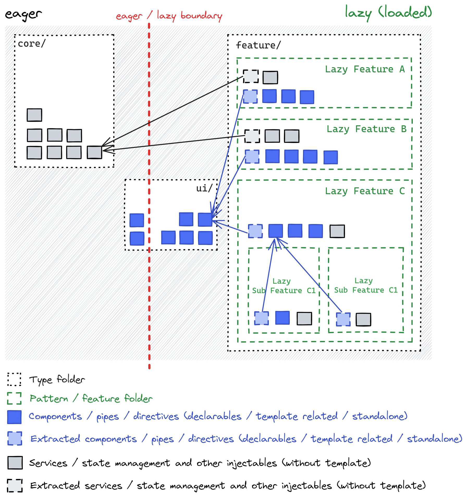
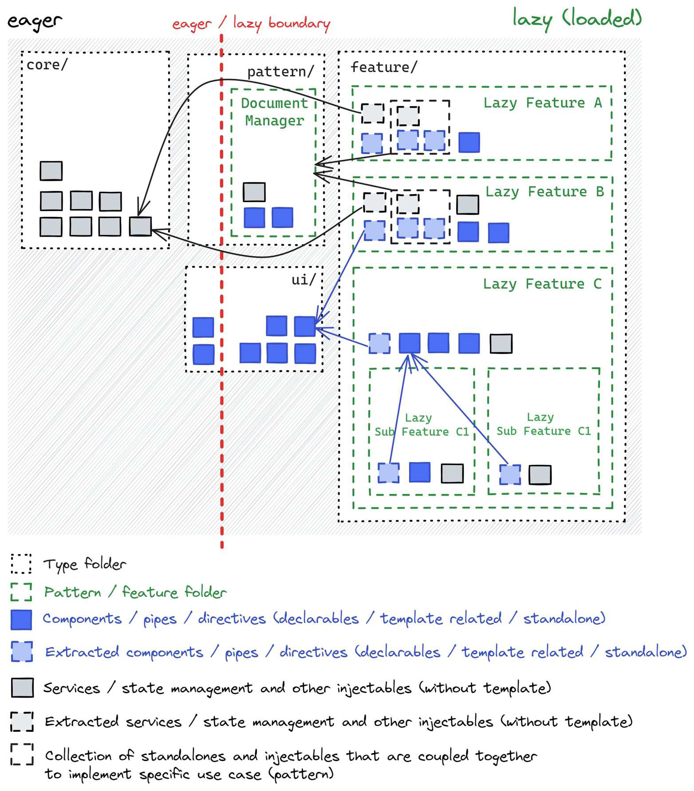

# Sharing logic between lazy features

Lazy features are usually isolated, but sometimes they need to share logic.

To keep things clean, we follow the **extract one level up** rule, i.e. moving shared logic to a higher-level
place where both features can access it.

Where exactly this "one level up" is depends on what kind of logic we're sharing, but the goal is to
keep the app organized and maintain a clear structure.

1. If first-level lazy features share something, it goes into a global folder.
2. If sub-features of the same parent share something, it stays inside their parent's folder.

=== "UI components"

    `Buttons`, `Badges`, `Dialogs`, `Menues`, `etc...`

    - Shared by **first-level features** -> move to `ui/`
    - Shared by **sub-features of the same parent** -> keep in `feature/parent-feature/`

=== "Core logic"

    `Services`, `State management`, `Utilities`, `etc...`

    - Shared by **first-level features** -> move to `core/`
    - Shared by **sub-features of the same parent** -> keep in `feature/parent-feature/`

    For core logic with multiple files, group them by domain (e.g., `core/orders/`, `core/products/`).

=== "Pattern logic and components"

    `DocumentManager`, `ItemChangeHistory`, `ApprovalProcess`, `etc...`

    - Shared by **first-level features** -> move to `pattern/`
    - Shared by **sub-features of the same parent** -> keep in `feature/parent-feature/`

This way, we avoid messy dependencies between sibling features.

## Extract one level up rule

=== "UI and Core"

    

=== "Pattern"

    
