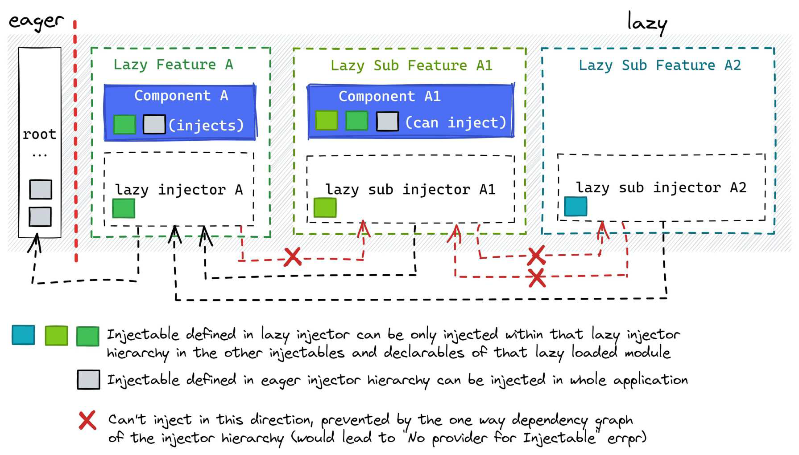

# Isolation benefit

Lazy loading helps keep different parts of the app isolated from each other. This is like putting
each feature in its own box, so they don't mix up.

For example, each feature in the app gets its own set of tools (services), and it can only use the
tools that belong to it. If we try to use a tool from another feature, the app will catch the
mistake and show an error.

This setup helps prevent us from accidentally using the wrong tools, making the app cleaner
and easier to manage. If we need to share a tool between features, we can move it to a central place,
like the "core" part of the app,
to keep everything organized.

