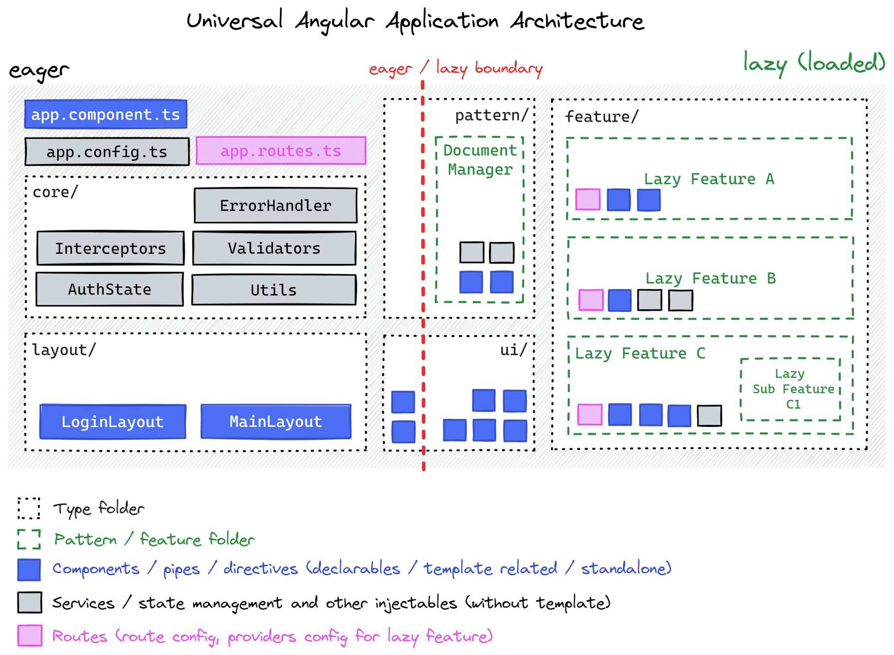

# The big picture

The following diagram captures the essence of the proposed architecture.

Please make sure to pay extra attention to the **eager / lazy boundary** and
notice that all the building block types are present in this one single diagram
including `core`, `layout`, `ui` , `pattern` and `feature`!

