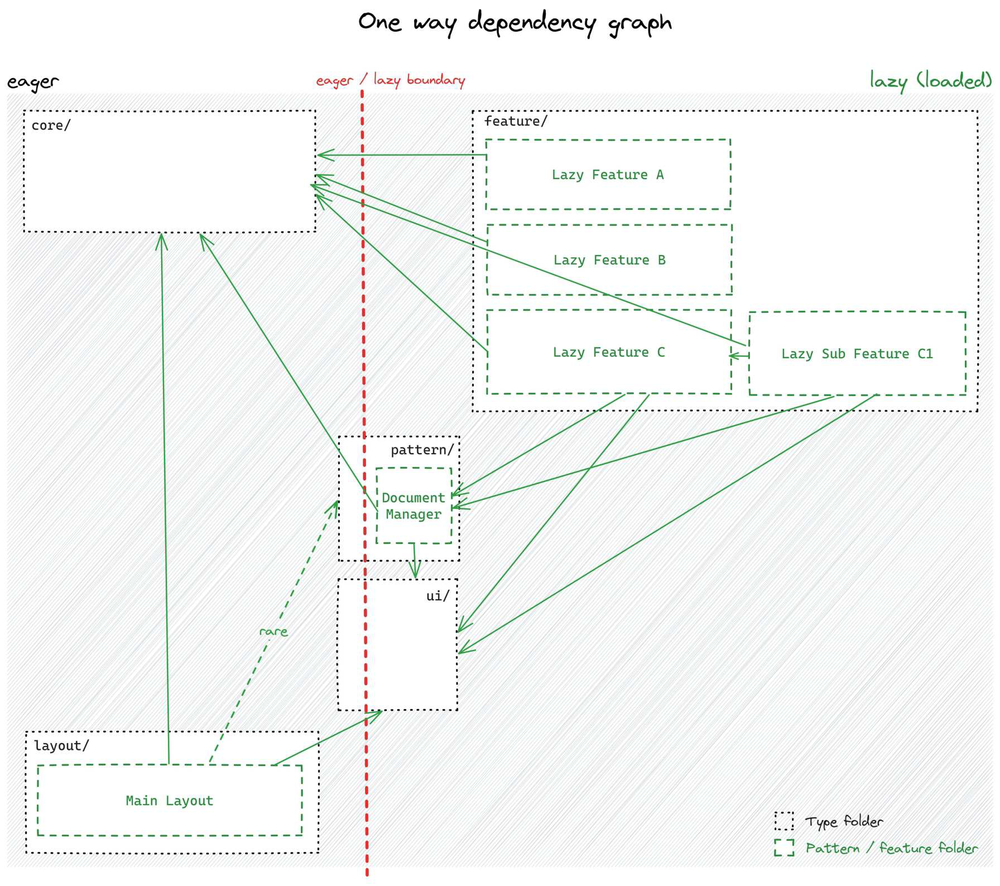

# Relationship between types

In an Angular app, different parts of the architecture follow a one-way dependency rule:
more complex parts (like features and patterns) depend on simpler parts (like `core` and `UI`),
but never the other way around.

This structure keeps things organized and prevents messy, circular dependencies.
Some shared `UI` or pattern components can be used in both eager (always loaded)
and lazy (loaded when needed) parts of the app.
However, lazy features and patterns should never directly depend on each other.

By following these rules, the application stays clean, scalable, and easy to manage.

!!! warning

    Always keep in mind that there should never be any dependency
    arrows between the sibling lazy features, sibling lazy sub features
    or between individual patterns!
