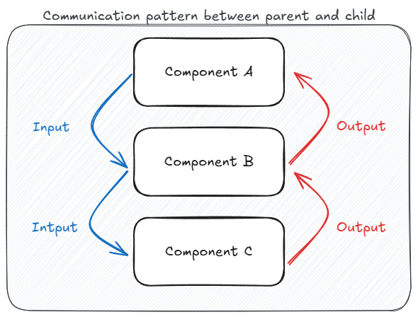

# Input and output

## Input

In Angular, **@Input** is used for passing data from a parent component to a child component.
In the "old" way, we use the `@Input()` decorator in the child component, allowing it to accept data
from the parent.

For example, in the `HomeComponent`, we pass the `user.name` to the `WelcomeComponent` by binding
it like this: `<app-welcome [name]="user.name" />`.

The child component then receives this value and displays it.

In the new approach with signals, instead of using `@Input()`, we use a function called `input()`
to declare the input. The value is then treated as a "signal" and is accessed by calling
`name()` within the component's template.

Both approaches allow the child component to react automatically when the parent changes the input value.

## Output

**@Output** allows child components to send data or events back to the parent component.
In the "old" way, this is done using the `EventEmitter` class.

For example, in the `WelcomeComponent`, when a user clicks a button to accept cookies, the child component
emits an event via `cookiesAccepted.emit(true)`. The parent component listens to this event using
`(cookiesAccepted)="handleCookies()"`, triggering the `handleCookies()` method when the event is emitted.

In the "new" way, output is handled with a function called `output()`, which is more ergonomic and
aligns better with the `input()` function. While it still uses `EventEmitter` under the hood,
this approach simplifies the syntax and removes the need to manually instantiate `EventEmitter`.

Both approaches enable the child component to notify the parent when certain actions occur, without
the child needing to know about external services or logic.

## Communcation

!!! info

    When components are siblings (not in a parent-child relationship), inputs and outputs can't be used
    to communicate between them directly. Instead, an injectable service is commonly used to share data
    or manage communication between them.
