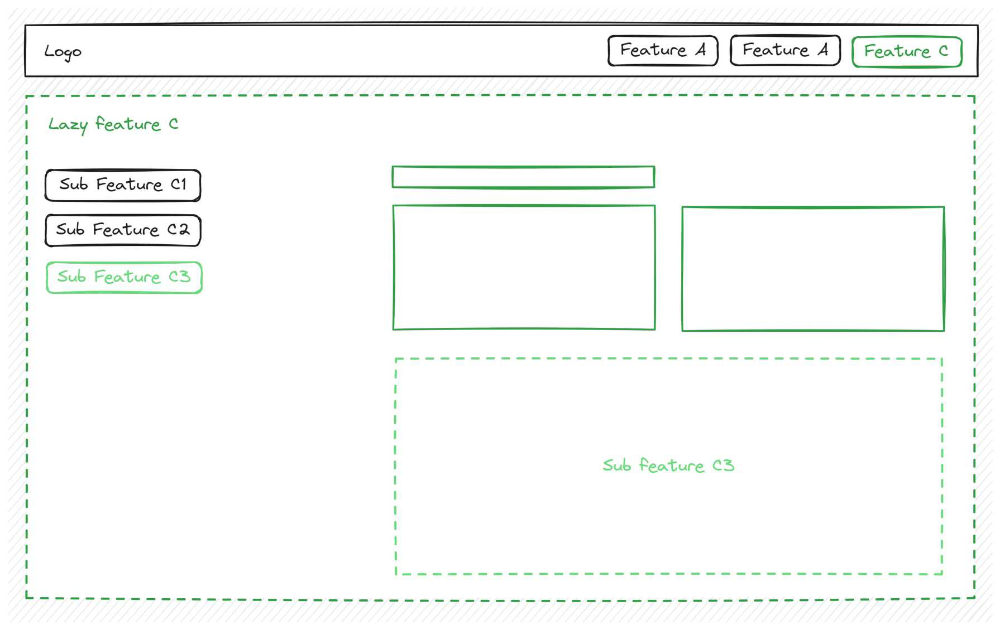

# Heuristics

Now that we understand why lazy loading is helpful, how do we decide what should be lazy-loaded?

A good rule of thumb is that **each page** in the app can be a lazy-loaded feature since most lazy
loading happens at the **route level** (when a user visits a page).

Some pages may have **nested sections** inside them, which can also be lazy-loaded separately
if they are complex enough.
This is useful because it allows users to **bookmark or share links** to specific parts of the app,
making navigation smoother.

Angular even supports multiple sections of a page being loaded at the same time, but that's an
advanced feature that is rarely used. [Named Router Outlets](https://angular.dev/api/router/RouterOutlet#description)

