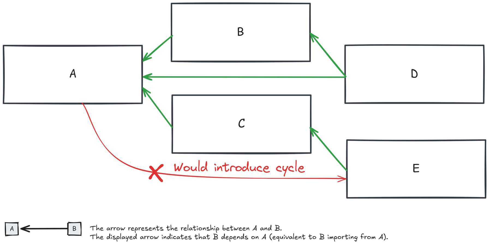

# One way dependency graph

The **one-way dependency graph** is an important concept in frontend architecture. In a simple graph,
we have components or features that point in one direction (green arrows).
This means each feature is only dependent on other features that come before it, not after it.

In this setup, we can remove a feature without affecting the rest of the application because
no other feature depends on it. This keeps the system organized and easier to manage.

If we add a cycle (a red arrow pointing backward), it becomes much harder to remove or change features
because they're now interconnected, making the code more complex and harder to untangle.

