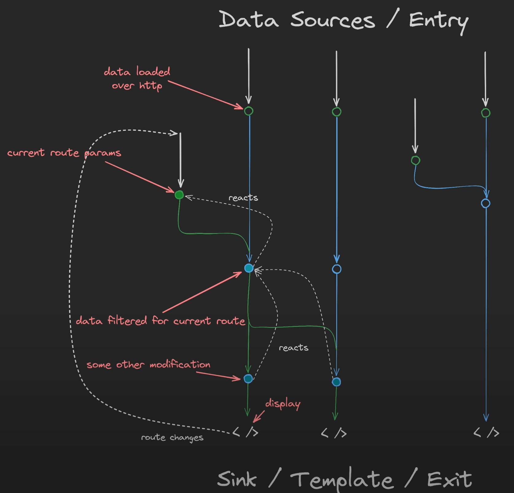

# Reactive programming analogy

One of the key concepts for reactive style programming is that we have data coming from some **source**
and it will end up in some **sink**.

We can imagine data flowing through our app like water in a stream.
That data might come from something like an HTTP request, and it's headed toward some destination—like
a component's template where we want to show it to the user.

The key is that we want the data to stay in the stream the whole way. We don't want to stop the flow
early by grabbing the data out (which we do when we “subscribe” to it too soon).
Instead, we want to let it keep flowing until the very end, where we finally display it.

When we subscribe to an observable, we're saying, “Give us the data now.” That stops it from reacting
to changes automatically. If we do this too early, we lose the benefits of reactivity and have to
manage everything ourselves.

So in reactive programming, we try to keep one connected stream all the way from the data source
(like an API) to the destination (like our template).
We only subscribe when we're ready to show it to someone or send it somewhere.

!!! tip

    Think of a raindrop falling on a mountain. It flows into tiny streams, joins with others,
    becomes a river, and finally reaches the ocean. Each step along the way, it stays in the water system.
    We can think of that ocean as our template or the final destination. Once it gets there,
    its journey is complete.

    Just like that, we want our data to stay in the stream and flow through our app,
    reacting and changing along the way, until it reaches the end. That's the heart of reactive flow.

[It's OK/NOT OK to subscribe in Angular](https://www.youtube.com/watch?v=bxslNFZvOvQ)
