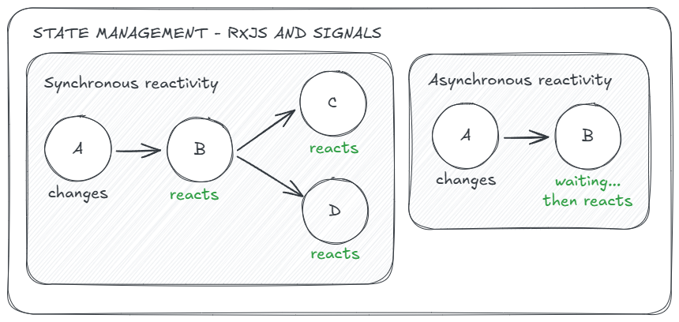

# RxJS and signals

Angular's `signals` were not created to replace `RxJS` but to complement it.
Both are reactive tools that let one value update automatically in response to changes in another.



**Signals** are great for **immediate, local updates**. We define a signal and a computed value based
on it. When the signal changes, the computed value updates automatically. We can access the value directly
without subscriptions.

```ts
count = signal(0);
doubleCount = computed(() => count() * 2);
```

We use **signals** for **state** and **synchronous** logic.

**Observables** are better for **async workflows**, like HTTP requests or user events.
They require subscribing to access values, and unsubscribing to avoid memory leaks.
In templates, Angular's `async` pipe helps with this.

```ts
count$ = new BehaviorSubject(0);
doubleCount$ = count$.pipe(map(count => count * 2));
```

We use **observables** for **events** and **asynchronous** logic.

They may look similar, but each has its strengths.
Used together, they cover a wide range of reactive needs in Angular.
