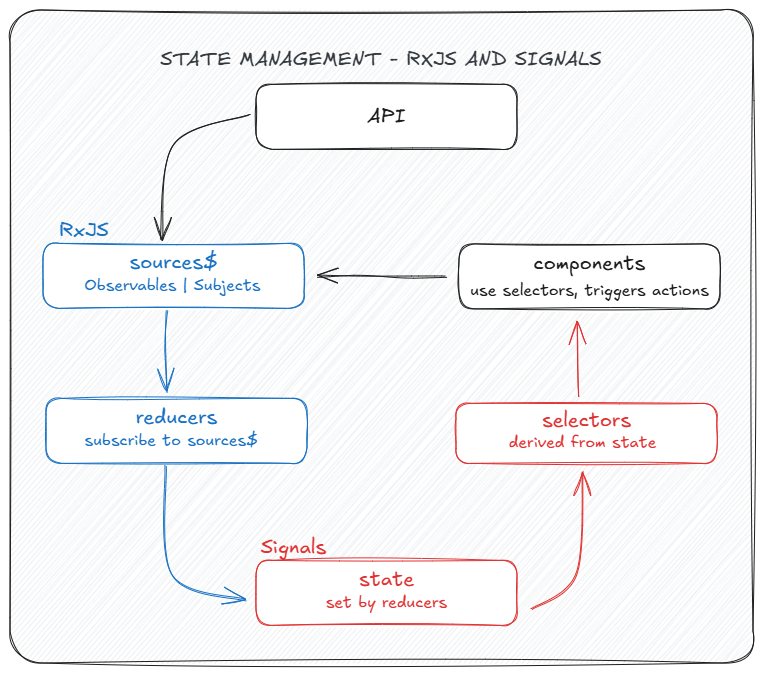

# State management with RxJS and signals

Using a state management library is often a wise choice because the library authors have already made
many important decisions and provide plenty of guides and documentation.
However, building our own state management system can be a great learning experience.

This section focuses on a simple, scalable approach that focuses on key concepts of state management
This approach is inspired by patterns like NgRx/Redux and StateAdapt, offering a reactive and
declarative solution without unnecessary complexity.
It's effective for managing state and easy to understand, especially if we’re familiar with the Redux
pattern.

## How it works



The flow involves how data enters the application, passes through state management, and is consumed
by components. We use RxJS for handling certain parts (blue), and Signals for others (red).
The transition between these tools is highlighted, and the same principles apply whether the code
is in a component or service. .

[New default for state management](https://www.youtube.com/watch?v=R4Ff2bPiWh4)

## State

To manage state, we first define what it looks like using an interface.
This helps us structure and track the state throughout the app.

We can then use this interface when setting up our **state signal**.

## Sources

We begin by defining the source of our data, which can be from outside (like an HTTP request)
or inside the app (such as a user action). If the data comes from outside, we use an `Observable`;
for internal events, we use a `Subject`.

## Reducers

Reducers update the state based on data from a source, like an HTTP request or a user action.
We subscribe to the source and, when new data arrives, we update the state using the spread syntax
to maintain the existing state values.

Although we could use `toSignal` for automatic subscription, a manual subscribe provides flexibility
in the reducer, allowing us to access and update the state directly.
However, we must avoid adding side effects in the subscription to keep the code declarative and clean.
Only state updates should occur within the subscription.

## Selectors

Selectors allow us to efficiently access specific parts of the state rather than the entire state.

For example, if we only need the `loaded` flag from the state, we create a selector like
`loaded = computed(() => this.state().loaded)`.

This ensures that we are only notified when the specific part of the state changes,
improving performance and convenience. Selectors are derived from signals and automatically update
whenever the state changes.

## Side effects

Side effects are actions triggered by state changes, like logging or sending data to a backend.
In Angular, we can handle side effects using the `effect` API. For example, we might log data when
an error occurs.

Side effects should not modify state directly. Instead, state changes should be handled through the
state management flow. Avoid triggering state changes in effects, as this can lead to infinite loops.
Use side effects only for actions like logging, saving data, or navigation, not for modifying application
state.

## Summary

This approach simplifies feature implementation by following a consistent pattern:

1. A source emits data.
2. Multiple sources may be combined.
3. The resulting source is subscribed to in the constructor.
4. The state signal is updated.
5. Components use the state from the signal.

For simple cases like toggling a modal's visibility, we can use a simple signal for synchronous reactivity
instead of the full state management process. This approach minimizes complexity and makes things predictable.

??? example

    ```ts
    type PortfoliosCommand = {
        command: "create" | "read" | "update" | "delete" | "clear";
        portfolioId: PortfolioId | null;
    };

    interface PortfoliosState {
        portfolios: Portfolio[];
        loaded: boolean;
        lastCommand: PortfoliosCommand;
        error: ErrorResponse[] | ErrorResponse | string | null;
    }

    @Injectable()
    export class PortfoliosService {
        private readonly http = inject(HttpClient);

        // state
        private readonly state = signal<PortfoliosState>({
            portfolios: [],
            loaded: false,
            lastCommand: <PortfoliosCommand>{ command: "read", portfolioId: null },
            error: null
        });

        // selectors
        portfolios = computed(() => this.state().portfolios);
        loaded = computed(() => this.state().loaded);
        lastCommand = computed(() => this.state().lastCommand);
        error = computed(() => this.state().error);

        // sources
        create$ = new Subject<CreatePortfolio>();
        update$ = new Subject<UpdatePortfolio>();
        delete$ = new Subject<DeletePortfolio>();
        clear$ = new Subject<unknown>();

        private error$ = new Subject<ErrorResponse[] | ErrorResponse | string | null>();

        private portfolioCreated$ = this.create$.pipe(
            concatMap((createPortfolio) =>
                this.http.post<PortfolioId>(ApiEndpoints.Portfolios, createPortfolio).pipe(
                    catchError((response) => this.handleHttpError(response)),
                    map((portfolioId) => <PortfoliosCommand>{ command: "create", portfolioId })
                )
            )
        );

        private portfolioUpdated$ = this.update$.pipe(
            mergeMap((updatePortfolio) =>
                this.http
                    .put(ApiEndpoints.Portfolio(updatePortfolio.portfolioId), updatePortfolio.data)
                    .pipe(
                        catchError((response) => this.handleHttpError(response)),
                        map(
                            () =>
                                <PortfoliosCommand>{
                                    command: "update",
                                    portfolioId: updatePortfolio.portfolioId
                                }
                        )
                    )
            )
        );

        private portfolioDeleted$ = this.delete$.pipe(
            concatMap((deletePortfolio) =>
                this.http.delete(ApiEndpoints.Portfolio(deletePortfolio)).pipe(
                    catchError((response) => this.handleHttpError(response)),
                    map(() => <PortfoliosCommand>{ command: "delete", portfolioId: null })
                )
            )
        );

        private portfolioCleared$ = this.clear$.pipe(
            map(() => <PortfoliosCommand>{ command: "clear", portfolioId: null })
        );

        constructor() {
            // reducers
            merge(
                this.portfolioCreated$,
                this.portfolioUpdated$,
                this.portfolioDeleted$,
                this.portfolioCleared$
            )
                .pipe(
                    startWith(<PortfoliosCommand>{ command: "read", portfolioId: null }),
                    switchMap((command) =>
                        this.http.get<Portfolio[]>(ApiEndpoints.Portfolios).pipe(
                            retry({ count: 2, delay: 5000 }),
                            catchError((response) => this.handleHttpError(response)),
                            map((portfolios) => ({ portfolios, command: command }))
                        )
                    ),
                    takeUntilDestroyed()
                )
                .subscribe({
                    next: (portfolios) =>
                        this.state.update((state) => ({
                            ...state,
                            portfolios: portfolios.portfolios,
                            lastCommand: portfolios.command,
                            loaded: true
                        }))
                });

            this.error$.pipe(takeUntilDestroyed()).subscribe((error) =>
                this.state.update((state) => ({
                    ...state,
                    error
                }))
            );

            effect(() => {
                if (this.error()) {
                    console.log(this.error());
                }
            });
        }

        private handleHttpError(response: HttpErrorResponse): Observable<never> {
            if (response.status === 400) {
                this.error$.next(response.error.error);
                return EMPTY;
            }

            this.error$.next(response.statusText);
            return EMPTY;
        }
    }
    ```
