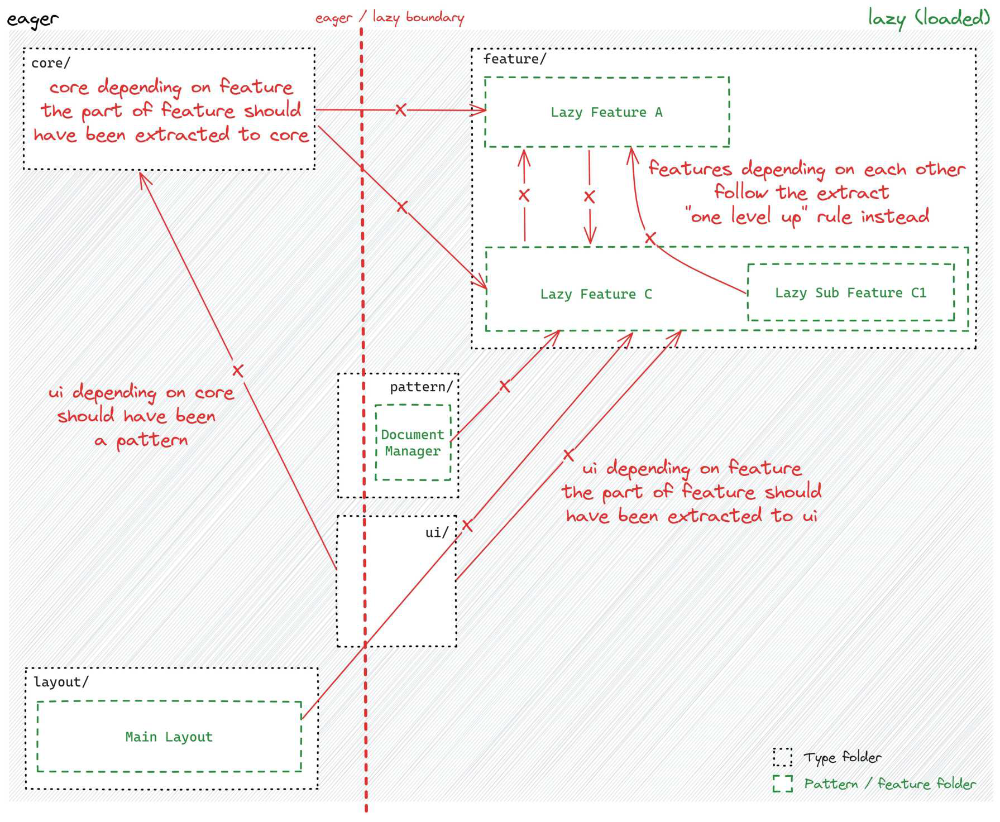

# Most comon type of dependency graph issues

When working on an existing Angular app, we might run into problems where different parts depend on
each other in ways that make the app harder to maintain and slower to load.

## Feature depends on another feature

One feature starts using logic from another feature instead of sharing it properly.

The fix? Move shared logic to the `core/` or `ui/` folder so both features can use it without depending
on each other.

## Core depends on a feature

The app's core logic should never rely on a feature because it breaks lazy loading and slows down
the app. Instead, move the needed logic into `core/` so it can be used properly.

## UI depends on core

A UI component should stay generic, but if it starts depending on a service or state,
it becomes tied to specific data. The fix? Create a **pattern** that bundles the UI with its needed
logic while keeping the UI itself reusable.

!!! danger

    The `core/` (or any other eager part of application) depending on a feature is especially problematic
    as it breaks lazy loading and the underlying bundling which has
    direct measurable negative consequence for the users (startup performance)
    and developers (rebuild time on every change).
