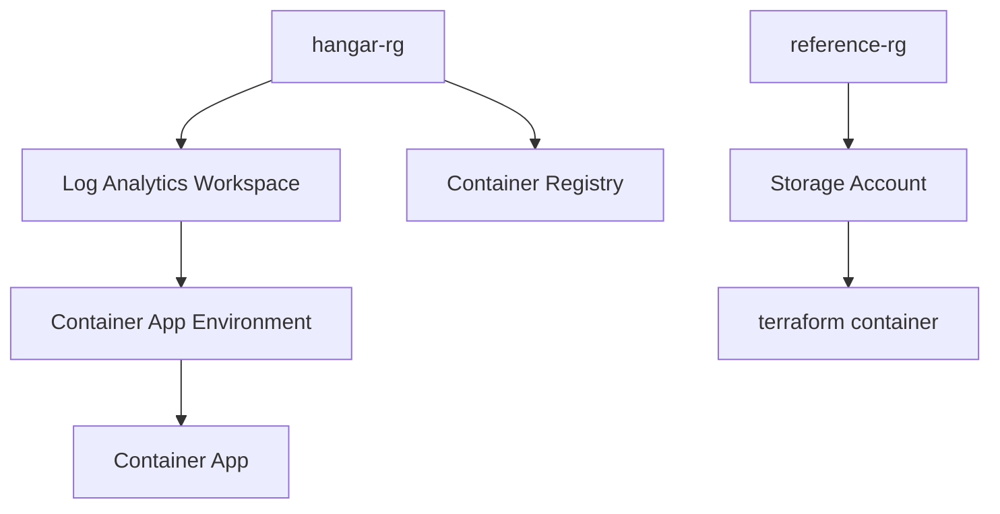

# Azure Infrastructure

This directory contains Terraform (OpenTofu) configurations for deploying Azure resources, including container apps,
storage, and more.

> Note: The current files are from a private personal project. I modified them to fit this repo.
> [Deployed Resource](https://krake-api-dev.mangoplant-23fd7721.westeurope.azurecontainerapps.io/)

## Infrastructure Overview

The Terraform configurations deploy the following resources:

- **Resource Groups**: `hangar-rg` (main) and `reference-rg` (for shared resources)
- **Storage Account**: `hangariacfiles` in `reference-rg` for Terraform state storage
- **Log Analytics Workspace**: For monitoring and logging
- **Container Registry**: `hangarregistry{env}` for storing container images
- **Container App Environment**: Runtime environment for container apps
- **Container App**: `hangar-api-{env}` running the application

The `reference-rg` and the `terraform` container in the storage account host the Terraform state file,
enabling CI/CD deployments without needing to manage local state files.

The Container App provides a simple and scalable way to host Docker images, offering benefits like automatic scaling,
built-in load balancing, and integration with Azure's ecosystem for easy deployment and management.

As a best practice, all resources are tagged with `environment` and `src` keys for better organization,
cost tracking, and resource management.



## Prerequisites

- [Azure CLI](https://docs.microsoft.com/en-us/cli/azure/install-azure-cli)
- [OpenTofu](https://opentofu.org/) (used instead of Terraform)
- Azure subscription with appropriate permissions

## Setup

### 1. Login to Azure

```bash
az login --use-device-code
```

### 2. Create Service Principal

Create a service principal for automated deployments:

```bash
az ad sp create-for-rbac --name devaccess
```

Example output:
```json
{
  "appId": "uuid",
  "displayName": "devaccess",
  "password": "pw",
  "tenant": "uuid"
}
```

Map the output to ARM_ environment variables:
- `appId` → `ARM_CLIENT_ID`
- `password` → `ARM_CLIENT_SECRET`
- `tenant` → `ARM_TENANT_ID`

Get the subscription ID:
```bash
az account show --query id -o tsv
```

This maps to `ARM_SUBSCRIPTION_ID`.

### 3. Assign Roles

Assign necessary roles to the service principal (replace `<subscription-id>` and `<client-id>` with actual values):

```bash
SUBSCRIPTION_ID="<subscription-id>"
SERVICE_PRINCIPAL_CLIENT_ID="<client-id>"

# Get the service principal object ID
SP_OBJECT_ID=$(az ad sp show --id "$SERVICE_PRINCIPAL_CLIENT_ID" --query id -o tsv)

# Assign Storage Blob Data Contributor role to service principal on storage account
az role assignment create \
  --assignee "$SP_OBJECT_ID" \
  --role "Storage Blob Data Contributor" \
  --scope "/subscriptions/$SUBSCRIPTION_ID/resourceGroups/reference-rg/providers/Microsoft.Storage/storageAccounts/hangariacfiles"

# Assign Contributor role to service principal on subscription
az role assignment create \
  --assignee "$SP_OBJECT_ID" \
  --role "Contributor" \
  --scope "/subscriptions/$SUBSCRIPTION_ID"
```

## Deployment

Use a variable file (e.g., `dev.tfvars`) for environment-specific values:

```bash
tofu plan -var-file=dev.tfvars
tofu apply -var-file=dev.tfvars
```

> Note: The OpenTofu workflow can be automated via GitHub Actions. See `.infra/deploy-infra-to-azure.yml` for details.

Create a `dev.tfvars` file (ignored by Git) with:

```hcl
subscription_id = "your-subscription-id"
```

## Troubleshooting

If you encounter errors due to unregistered providers, register the required namespaces:

```bash
az provider register --namespace Microsoft.Sql
az provider register --namespace Microsoft.App
```

Ensure you have the correct credentials and roles assigned. Check your Azure account permissions and service
principal roles if authentication fails.
